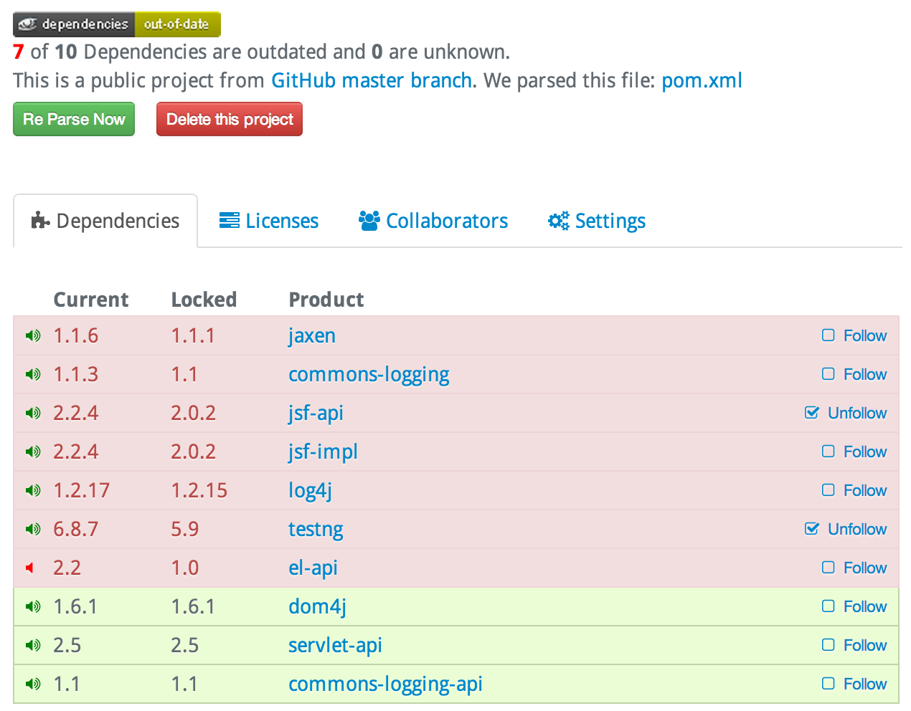

[](http://www.versioneye.com/user/projects/51e2af93cbe2eb000203df22)

# VersionEye Maven Plugin

The [maven](http://maven.apache.org/) plugin for [VersionEye](http://www.versioneye.com) helps you to create or update a project at VersionEye. 
VersionEye is a platform for Continuous Updating. It will help you to keep your projects up-to-date and notify you automatically about outdated dependencies. You can check it out here: [www.versioneye.com](http://www.versioneye.com). 

## Install

Currently this plugin is not on any maven repository server. That's why you have to use the code: 

```
git clone https://github.com/versioneye/versioneye_maven_plugin.git
```

Switch to the root directory of the project: 

```
cd versioneye_maven_plugin
```

And install it in your local maven repository: 

```
mvn clean install 
```

Now the plugin is installed on your local machine! 

Switch to the project where you want to use this plugin. You can add the plugin to your project by adding this snippet to your pom.xml file.  

```
<build>
  <plugins>
    <plugin>
      <groupId>versioneye</groupId>
      <artifactId>versioneye-maven-plugin</artifactId>
      <version>1.0.0-SNAPSHOT</version>
    </plugin>
  </plugins>
</build>
```

That's it. The plugin is installed and added to your project.

## Getting Started

You can check out all goals like this

```
mvn versioneye:help
```
That will output all possible goals on the versioneye plugin. 

Now you can check if the [VersionEye API](https://www.versioneye.com/api?version=v2) is available: 

```
mvn versioneye:ping
```
That should return an output like this: 

```
{"success":true,"message":"pong"}
```
 
Now try this: 

```
mvn versioneye:list
```

That will get you a list with all your direct and recursive dependencies and it will tell you how many dependencies you have in your project altogether.

Here you can convert your pom.xml to a pom.json 

```
mvn versioneye:json 
```
It will take all your direct dependencies and convert them into "/target/pom.json". This is just for fun! You don't really need it, but I thought it's fun to write a small pom.xml to pom.json converter :-)  

## API Key

This plugin can push your dependencies to the VersionEye API, create a project at VersionEye and tell you which of your dependencies are outdated. VersionEye will check your project automatically and notify you about outdated dependencies. You can use some of the resources at the VersionEye API without an API KEY, but for the project resource you need one. If you are [signed up](https://www.versioneye.com/signup) you can find your API KEY here: [https://www.versioneye.com/settings/api](https://www.versioneye.com/settings/api). 


If you have your API KEY, create a properties file and add your KEY like this:  

```
echo "api_key=YOUR_API_KEY" > versioneye.properties
```

The versioneye-maven-plugin will look in 2 places for the versioneye.properties file. First of all it will look in your project root directory under: 

```
src/main/resources/versioneye.properties
```

If it can't find the file there it will look it up at this place: 

```
~/.m2/versioneye.properties
```

That means if you don't want to commit your API KEY to the server and share it with your team you can place the file in your home directory and keep it for you. 

## Create

If your API KEY is in place you can create a project at VersionEye based on the dependencies in your pom.xml. Just execute this: 

```
mvn versioneye:create
```

This command will NOT change your local project. It just sends your dependencies to the VersionEye server and creates, based on that, a projct at [www.versioneye.com](http://www.versioneye.com). If everything went right you will see in the output the URL to your new created VersionEye project. Just copy and paste it into you browser to check it out. Here is an example how it could look like: 



Besides that, the plugin will add a project_id and project_key to the versioneye.properties file. The project_id is the connection between your pom.xml and the VersionEye project.

## Update 

With this command here you can update an existing VersionEye project: 

```
mvn versioneye:update
``` 
That will simply update the existing VersionEye project with the dependencies from your pom.xml. It will NOT change your pom.xml.

## Feedback

If you have questions, find bugs or feature requests to this project, feel free to open a ticket [here](https://github.com/versioneye/versioneye_maven_plugin/issues). Pull Requests are welcome! 
